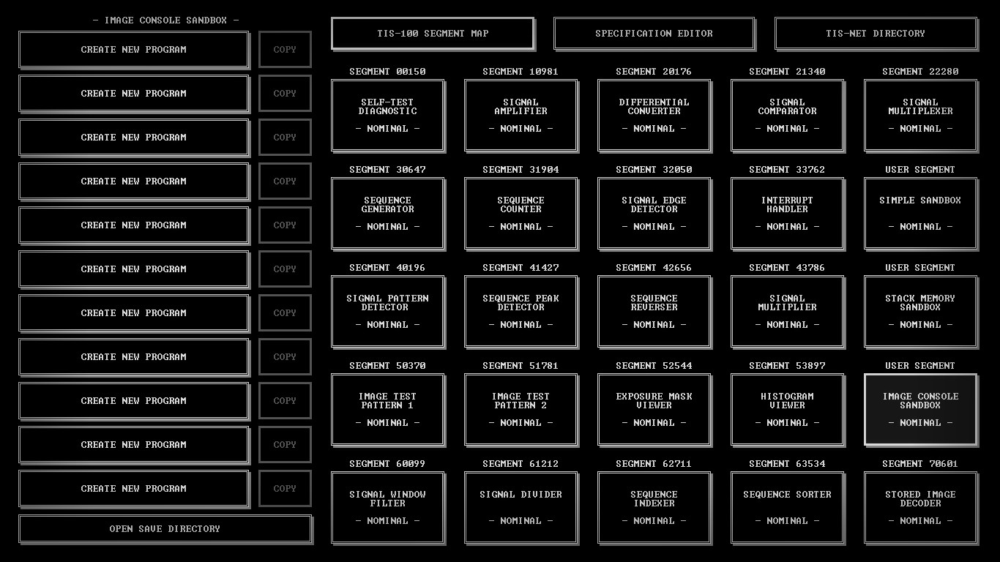

# TIS-100

My solutions for a [TIS-100](https://en.wikipedia.org/wiki/TIS-100) game.

## Solutions

Solutions to all levels presented via SaveFile + Screenshot.

### TIS-100 segment map

* Self-test diagnostic([Savefile](SaveFiles/00150.txt), [ScreenShot](ScreenShots/00150.jpg)),
* Signal amplifier([Savefile](SaveFiles/10981.txt), [ScreenShot](ScreenShots/10981.jpg)),
* Differential converter([Savefile](SaveFiles/20176.txt), [ScreenShot](ScreenShots/20176.jpg)),
* Signal comparator([Savefile](SaveFiles/21340.txt), [ScreenShot](ScreenShots/21340.jpg)),
* Signal multiplexer([Savefile](SaveFiles/22280.txt), [ScreenShot](ScreenShots/22280.jpg)),
* Sequence generator([Savefile](SaveFiles/30647.txt), [ScreenShot](ScreenShots/30647.jpg)),
* Sequence counter([Savefile](SaveFiles/31904.txt), [ScreenShot](ScreenShots/31904.jpg)),
* Signal edge detector([Savefile](SaveFiles/32050.txt), [ScreenShot](ScreenShots/32050.jpg)),
* Interrupt handler([Savefile](SaveFiles/33762.txt), [ScreenShot](ScreenShots/33762.jpg)),
* Signal pattern detector([Savefile](SaveFiles/40196.txt), [ScreenShot](ScreenShots/40196.jpg)),
* Sequence peak detector([Savefile](SaveFiles/41427.txt), [ScreenShot](ScreenShots/41427.jpg)),
* Sequence reverser([Savefile](SaveFiles/42656.txt), [ScreenShot](ScreenShots/42656.jpg)),
* Signal multiplier([Savefile](SaveFiles/43786.txt), [ScreenShot](ScreenShots/43786.jpg)),
* Image test pattern 1([Savefile](SaveFiles/50370.txt), [ScreenShot](ScreenShots/50370.jpg)),
* Image test pattern 2([Savefile](SaveFiles/51781.txt), [ScreenShot](ScreenShots/51781.jpg)),
* Exposure mask viewer([Savefile](SaveFiles/52544.txt), [ScreenShot](ScreenShots/52544.jpg)),
* Histogram viewer([Savefile](SaveFiles/53897.txt), [ScreenShot](ScreenShots/53897.jpg)),
* Signal window filter([Savefile](SaveFiles/60099.txt), [ScreenShot](ScreenShots/60099.jpg)),
* Signal divider([Savefile](SaveFiles/61212.txt), [ScreenShot](ScreenShots/61212.jpg)),
* Sequence indexer([Savefile](SaveFiles/62711.txt), [ScreenShot](ScreenShots/62711.jpg)),
* Sequence sorter([Savefile](SaveFiles/63534.txt), [ScreenShot](ScreenShots/63534.jpg)),
* Stored image decoder([Savefile](SaveFiles/70601.txt), [ScreenShot](ScreenShots/70601.jpg)).

### Credits

[My Steam Profile](http://steamcommunity.com/profiles/76561198033544751/)
