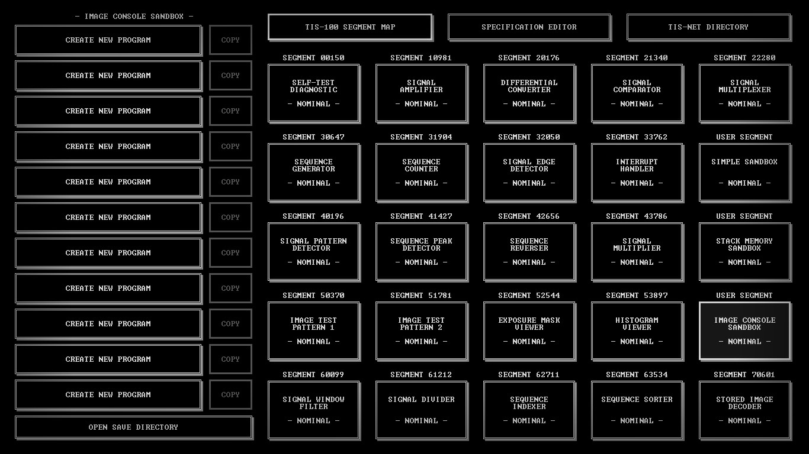
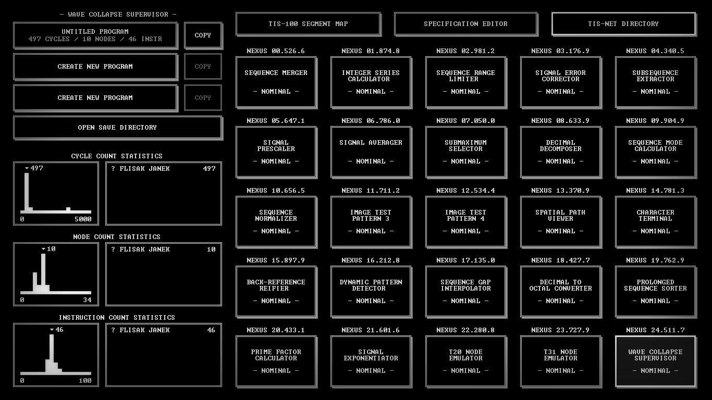

# TIS-100

My solutions for a [TIS-100](https://en.wikipedia.org/wiki/TIS-100) game.

## Solutions

Solutions to all levels presented via SaveFile + Screenshot.

### TIS-100 segment map

* Self-test diagnostic([Savefile](SaveFiles/00150.txt), [ScreenShot](ScreenShots/00150.jpg)),
* Signal amplifier([Savefile](SaveFiles/10981.txt), [ScreenShot](ScreenShots/10981.jpg)),
* Differential converter([Savefile](SaveFiles/20176.txt), [ScreenShot](ScreenShots/20176.jpg)),
* Signal comparator([Savefile](SaveFiles/21340.txt), [ScreenShot](ScreenShots/21340.jpg)),
* Signal multiplexer([Savefile](SaveFiles/22280.txt), [ScreenShot](ScreenShots/22280.jpg)),
* Sequence generator([Savefile](SaveFiles/30647.txt), [ScreenShot](ScreenShots/30647.jpg)),
* Sequence counter([Savefile](SaveFiles/31904.txt), [ScreenShot](ScreenShots/31904.jpg)),
* Signal edge detector([Savefile](SaveFiles/32050.txt), [ScreenShot](ScreenShots/32050.jpg)),
* Interrupt handler([Savefile](SaveFiles/33762.txt), [ScreenShot](ScreenShots/33762.jpg)),
* Signal pattern detector([Savefile](SaveFiles/40196.txt), [ScreenShot](ScreenShots/40196.jpg)),
* Sequence peak detector([Savefile](SaveFiles/41427.txt), [ScreenShot](ScreenShots/41427.jpg)),
* Sequence reverser([Savefile](SaveFiles/42656.txt), [ScreenShot](ScreenShots/42656.jpg)),
* Signal multiplier([Savefile](SaveFiles/43786.txt), [ScreenShot](ScreenShots/43786.jpg)),
* Image test pattern 1([Savefile](SaveFiles/50370.txt), [ScreenShot](ScreenShots/50370.jpg)),
* Image test pattern 2([Savefile](SaveFiles/51781.txt), [ScreenShot](ScreenShots/51781.jpg)),
* Exposure mask viewer([Savefile](SaveFiles/52544.txt), [ScreenShot](ScreenShots/52544.jpg)),
* Histogram viewer([Savefile](SaveFiles/53897.txt), [ScreenShot](ScreenShots/53897.jpg)),
* Signal window filter([Savefile](SaveFiles/60099.txt), [ScreenShot](ScreenShots/60099.jpg)),
* Signal divider([Savefile](SaveFiles/61212.txt), [ScreenShot](ScreenShots/61212.jpg)),
* Sequence indexer([Savefile](SaveFiles/62711.txt), [ScreenShot](ScreenShots/62711.jpg)),
* Sequence sorter([Savefile](SaveFiles/63534.txt), [ScreenShot](ScreenShots/63534.jpg)),
* Stored image decoder([Savefile](SaveFiles/70601.txt), [ScreenShot](ScreenShots/70601.jpg)).

### TIS-NET directory

* Sequence merger([SaveFile](SaveFiles/NEXUS.00.526.6.0.txt), [ScreenShot](ScreenShots/NEXUS.00.526.6.jpg)),
* Integer series calculator([SaveFile](SaveFiles/NEXUS.01.874.8.0.txt), [ScreenShot](ScreenShots/NEXUS.01.874.8.jpg)),
* Sequence range limiter([SaveFile](SaveFiles/NEXUS.02.981.2.0.txt), [ScreenShot](ScreenShots/NEXUS.02.981.2.jpg)),
* Signal error corrector([SaveFile](SaveFiles/NEXUS.03.176.9.0.txt), [ScreenShot](ScreenShots/NEXUS.03.176.9.jpg)),
* Subsequence extraction([SaveFile](SaveFiles/NEXUS.04.340.5.0.txt), [ScreenShot](ScreenShots/NEXUS.04.340.5.jpg)),
* Signal prescaler([SaveFile](SaveFiles/NEXUS.05.647.1.0.txt), [ScreenShot](ScreenShots/NEXUS.05.647.1.jpg)),
* Signal averager([SaveFile](SaveFiles/NEXUS.06.786.0.0.txt), [ScreenShot](ScreenShots/NEXUS.06.786.0.jpg)),
* Submaximum selector([SaveFile](SaveFiles/NEXUS.07.050.0.0.txt), [ScreenShot](ScreenShots/NEXUS.07.050.0.jpg)),
* Decimal decomposer([SaveFile](SaveFiles/NEXUS.08.633.9.0.txt), [ScreenShot](ScreenShots/NEXUS.08.633.9.jpg)),
* Sequence mode calculator([SaveFile](SaveFiles/NEXUS.09.904.9.0.txt), [ScreenShot](ScreenShots/NEXUS.09.904.9.jpg)),
* Sequence normalizer([SaveFile](SaveFiles/NEXUS.10.656.5.0.txt), [ScreenShot](ScreenShots/NEXUS.10.656.5.jpg)),
* Image test pattern 3([SaveFile](SaveFiles/NEXUS.11.711.2.0.txt), [ScreenShot](ScreenShots/NEXUS.11.711.2.jpg)),
* Image test pattern 4([SaveFile](SaveFiles/NEXUS.12.534.4.0.txt), [ScreenShot](ScreenShots/NEXUS.12.534.4.jpg)),
* Spatial path viewer([SaveFile](SaveFiles/NEXUS.13.370.9.0.txt), [ScreenShot](ScreenShots/NEXUS.13.370.9.jpg)),
* Character terminal([SaveFile](SaveFiles/NEXUS.14.781.3.0.txt), [ScreenShot](ScreenShots/NEXUS.14.781.3.jpg)),
* Back-reference reifier([SaveFile](SaveFiles/NEXUS.15.897.9.0.txt), [ScreenShot](ScreenShots/NEXUS.15.897.9.jpg)),
* Dynamic pattern detector([SaveFile](SaveFiles/NEXUS.16.212.8.0.txt), [ScreenShot](ScreenShots/NEXUS.16.212.8.jpg)),
* Sequence gap interpolator([SaveFile](SaveFiles/NEXUS.17.135.0.0.txt), [ScreenShot](ScreenShots/NEXUS.17.135.0.jpg)),
* Decimal to octal converter([SaveFile](SaveFiles/NEXUS.18.427.7.0.txt), [ScreenShot](ScreenShots/NEXUS.18.427.7.jpg)),
* Prolonged sequence sorter([SaveFile](SaveFiles/NEXUS.19.762.9.0.txt), [ScreenShot](ScreenShots/NEXUS.19.762.9.jpg)),
* Prime factor calculator([SaveFile](SaveFiles/NEXUS.20.433.1.0.txt), [ScreenShot](ScreenShots/NEXUS.20.433.1.jpg)),
* Signal exponentiator([SaveFile](SaveFiles/NEXUS.21.601.6.0.txt), [ScreenShot](ScreenShots/NEXUS.21.601.6.jpg)),
* T20 node emulator([SaveFile](SaveFiles/NEXUS.22.280.8.0.txt), [ScreenShot](ScreenShots/NEXUS.22.280.8.jpg)),
* T31 mode emulator([SaveFile](SaveFiles/NEXUS.23.727.9.0.txt), [ScreenShot](ScreenShots/NEXUS.23.727.9.jpg)),
* Wave collapse supervisor([SaveFile](SaveFiles/NEXUS.24.511.7.0.txt), [ScreenShot](ScreenShots/NEXUS.24.511.7.jpg)).

### Credits

[My Steam Profile](http://steamcommunity.com/profiles/76561198033544751/)
